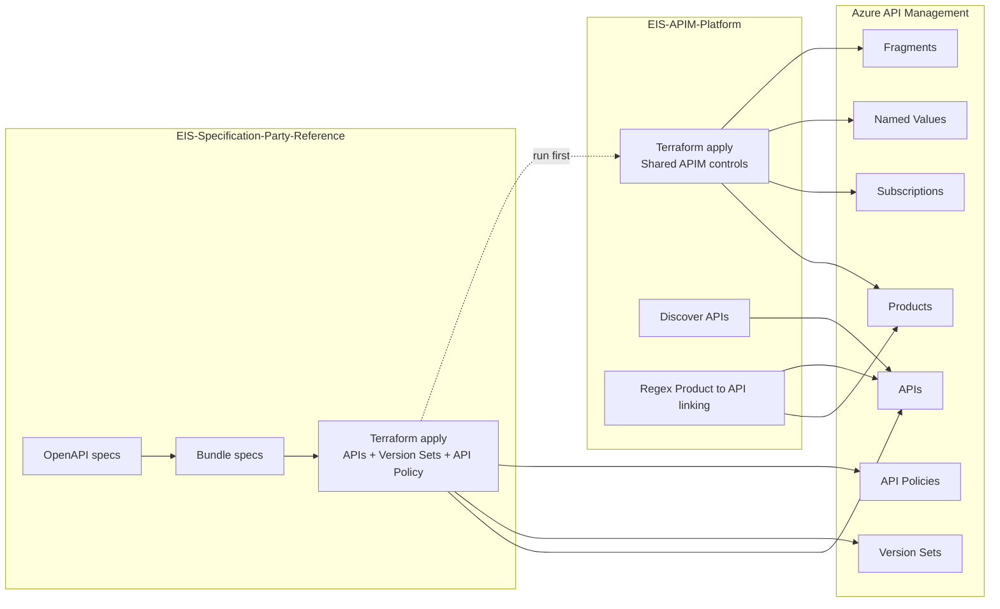

# APIM Monorepo

This repository combines two APIM-focused codebases into one Git repository:

- `EIS-APIM-Platform`
- `EIS-Specification-Party-Reference`

The two folders are intentionally separated by ownership and deployment scope.

# Repository Purpose

Use this monorepo to manage:

1. Shared APIM platform configuration and governance controls.
2. API-specific OpenAPI import, API version sets, and API-level policy.
3. Coordinated deployment order across environments (`stage`, `prod`).

## Folder Ownership

### `EIS-APIM-Platform`

Owns shared APIM constructs:

- policy fragments (reusable XML)
- product policies
- products
- product-to-API links (regex-based)
- subscriptions
- named values (including secret values)
- backends

Does not import APIs from OpenAPI documents.

### `EIS-Specification-Party-Reference`

Owns API-level deployment concerns:

- OpenAPI specs
- spec bundling
- APIM API version sets
- APIM APIs import
- API-level policy attachment
- API-level subscription settings

Does not own products, product policies, named values, or shared fragment lifecycle.

## Deployment Environments

Both folders support:

- `stage`
- `prod`

Credential naming and backend files are environment-specific in each pipeline.

## Recommended CI Run Order

Run in this order for each environment:

1. `EIS-Specification-Party-Reference`
2. `EIS-APIM-Platform`

Why:

1. API repo creates/updates APIs and version sets first.
2. Platform repo then discovers those APIs and reconciles product links and shared policies.

Re-run platform deployment whenever API names or versions change.

## Architecture Diagram

## Standard Pipeline Flow

### API Repo (`EIS-Specification-Party-Reference`)

1. Bundle OpenAPI files.
2. `terraform init` using environment backend tfvars.
3. `terraform validate`.
4. `terraform plan`.
5. `terraform apply`.

### Platform Repo (`EIS-APIM-Platform`)

1. `terraform init` in `terraform/envs/<env>`.
2. `terraform validate`.
3. `terraform plan`.
4. `terraform apply`.

## Operational Guardrails

1. Keep production approval gates enabled.
2. Use unique remote state keys per environment and scope.
3. Keep generated local artifacts out of source control:
   - `**/.terraform/`
   - `**/.terraform.lock.hcl`
   - `*.tfstate`
   - `*.tfstate.backup`
4. Keep API ownership in API repos and shared platform ownership in platform repo.

## New API Onboarding Checklist

When adding a new API specification repository to this monorepo model:

1. Add/verify OpenAPI metadata used by Terraform (`x-apim` fields and tags).
2. Ensure API repo pipeline bundles specs and applies Terraform successfully in `stage`.
3. Verify API appears in APIM with expected path, version, and backend URL.
4. Update platform product regex patterns (if needed) to include new API naming.
5. Run platform pipeline and confirm Product-to-API links are created.
6. Validate subscription behavior and policy inheritance in APIM.
7. Promote in the same order for `prod` after approval.

## Troubleshooting Quick Notes

1. Product links missing after API deploy:
   - Re-run `EIS-APIM-Platform`.
   - Check product regex patterns and expected API name matches.
2. API policy include-fragment failure:
   - Confirm fragment IDs exist in platform deployment.
3. Plan/apply auth failure:
   - Verify Jenkins credential IDs for selected environment.
4. No spec files discovered:
   - Check spec folder path and bundling output location.

## Local Git Notes

This monorepo treats subfolders as normal directories, not nested Git repositories or submodules.
